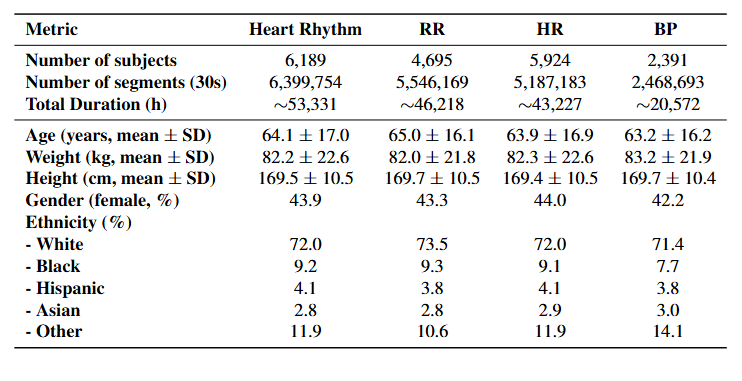
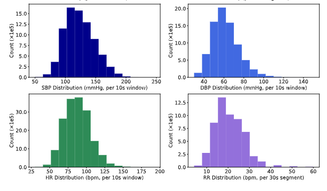

# 🫀 MIMIC-III-Ext-PPG

**MIMIC-III-Ext-PPG** is a large-scale dataset for **cardiorespiratory signal analysis** derived from the MIMIC-III Waveform Database. This repository serves as the **official hub for documentation and code resources** related to the dataset.

---

## 🔗 Dataset Access (PhysioNet)

📦 **MIMIC-III-Ext-PPG v1.1.0**

https://physionet.org/content/mimic-iii-ext-ppg/1.1.0/

##  Benchmarking paper

[https://arxiv.org/abs/2603.21832
](https://arxiv.org/abs/2603.21832)
---

# 📊 Overview

**MIMIC-III-Ext-PPG** is a large-scale physiological signal dataset designed for **machine learning and biomedical signal processing research**.

The dataset is derived from the **MIMIC-III Waveform Database Matched Subset** and provides curated physiological signals.

🧬 **Signals included**

- 🫀 **PPG (PLETH)** 💓 **ECG** 🩸 **Arterial Blood Pressure (ABP)** 🌬 **Respiratory signals (RESP)**

📑 Each segment is associated with:

- 🫀 heart rhythm annotations  
- 👤 demographic information  
- 🏥 clinical metadata  
- 📈 physiological measurements  

---

# 🔬 Supported Research Tasks

The dataset enables research in:

- 🧠 heart rhythm classification
- ❤️ atrial fibrillation detection
- 🩸 blood pressure estimation
- 🌬 respiratory rate estimation
- 💓 heart rate estimation
- 📉 signal quality assessment
- 🤖 machine learning for biomedical signals

---

##  v1.1.0 — Current Public Release

Available on **PhysioNet** (https://doi.org/10.13026/r6k1-xt76)

| Property | Value |
|------|------|
| 👥 Subjects | ~6,189 |
| 📦 Segments (30 s) | ~6.3 million |
| 📡 Signals | PPG, ECG, ABP, RESP |
| 📑 Metadata | demographics, rhythm labels, physiological measurements |
---

MIMIC-III-Ext-PPG  
│  
├── 👤 Subject (subject_id)  
│  
├── 📁 Record (record_id)  
│   │  
│   ├── 🫀 Event (event_id)  
│   │   │  
│   │   ├── 📦 Segment (30 seconds)  

➡️ **MIMIC-III-Ext-PPG Code Repository**

Source code and pipelines are available in the **`Source_codes`** directory:

---

# 📚 Citation

If you use this dataset, please cite:

Moulaeifard, M., Charlton, P. H., & Strodthoff, N. (2026). MIMIC-III-Ext-PPG: A PPG Benchmark Dataset for Cardiorespiratory Analysis (version 1.1.0). PhysioNet. RRID:SCR_007345. https://doi.org/10.13026/r6k1-xt76

or BibTeX:

@article{PhysioNet-mimic-iii-ext-ppg-1.1.0,
  author = {Moulaeifard, Mohammad and Charlton, Peter H and Strodthoff, Nils},
  title = {{MIMIC-III-Ext-PPG: A  PPG Benchmark Dataset for Cardiorespiratory Analysis}},
  journal = {{PhysioNet}},
  year = {2026},
  month = mar,
  note = {Version 1.1.0},
  doi = {10.13026/r6k1-xt76},
  url = {https://doi.org/10.13026/r6k1-xt76}
}

---

## 👥 Contributors

- 💻 [**Mohammad Moulaeifard**](https://github.com/mMoulaeifard)  
- 💻 [**Peter Charlton**](https://github.com/peterhcharlton)  
- 💻 [**Nils Strodthoff**](https://github.com/nstrodt)

